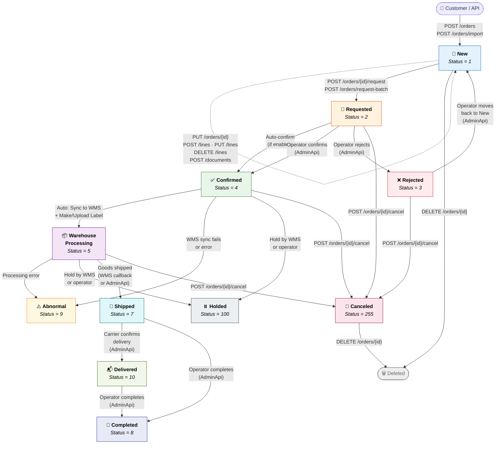
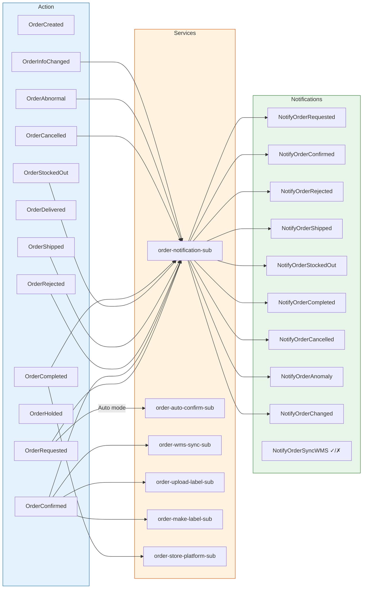
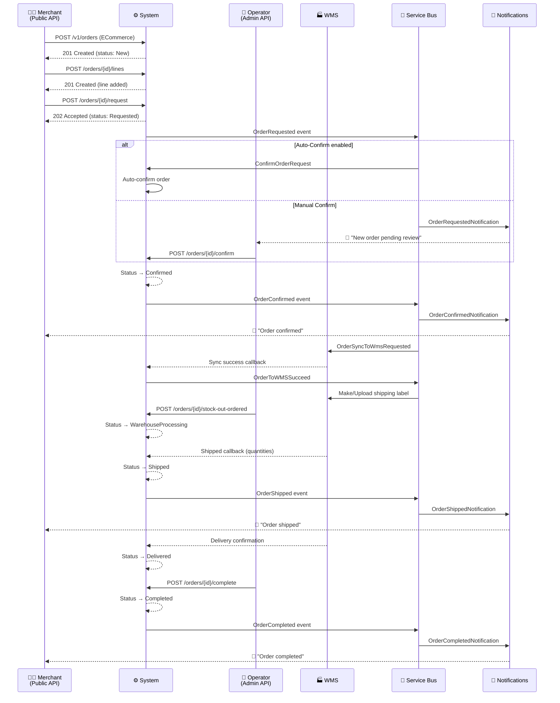
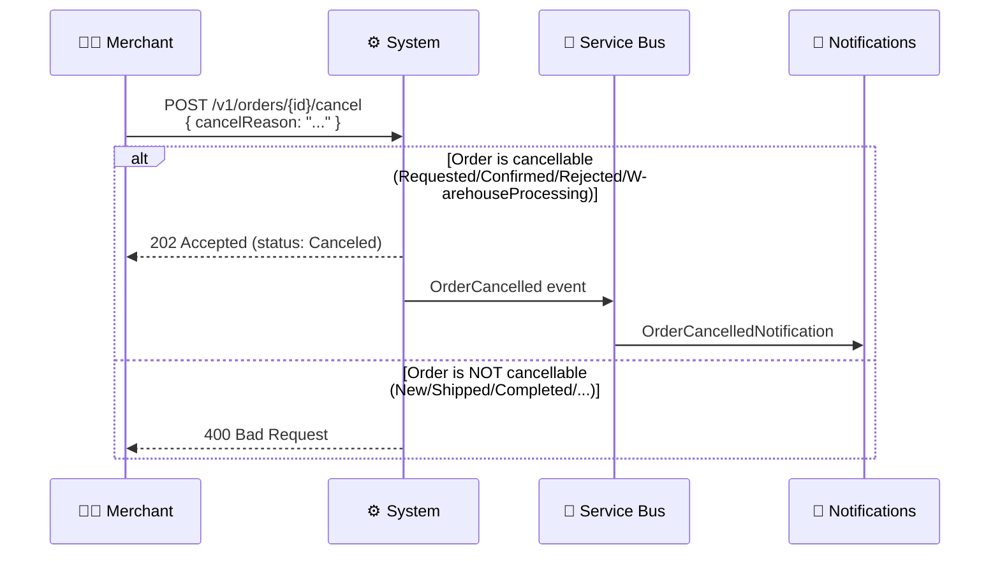

# Order Workflow

> This document describes the complete order lifecycle — from creation through fulfillment — including API actions, status transitions, and events/notifications fired at each step.

---

## Order Status Overview

| Status | Value | Description |
|--------|-------|-------------|
| New | 1 | Order created, editable (add/edit lines, documents, info) |
| Requested | 2 | Submitted for operator review |
| Rejected | 3 | Operator rejected the order |
| Confirmed | 4 | Approved, triggers WMS sync & shipping label |
| WarehouseProcessing | 5 | Warehouse is picking/packing the order |
| Shipped | 7 | Goods shipped out from warehouse |
| Delivered | 10 | Carrier confirmed delivery |
| Completed | 8 | Order finalized and closed |
| Abnormal | 9 | Error occurred during processing (WMS sync fail, etc.) |
| Holded | 100 | Temporarily on hold by WMS or operator |
| Canceled | 255 | Order cancelled |

---

## Complete Order Lifecycle Flow

---

## Status Transition Rules

The table below shows which statuses an order can transition **from → to**, and who triggers it.

| From | To | Triggered By | API / Mechanism |
|------|----|-------------|-----------------|
| Create/ Import | **New** | Merchant | `POST /v1/orders` or `POST /v1/orders/import` |
| New | **Requested** | Merchant | `POST /v1/orders/{id}/request` |
| Requested, Rejected | **New** | Operator | AdminApi: `POST /orders/{id}/to-new` |
| Requested | **Confirmed** | Operator or Auto | AdminApi: `POST /orders/{id}/confirm` or auto-confirm event |
| Requested | **Rejected** | Operator | AdminApi: `POST /orders/{id}/reject` |
| Confirmed | **WarehouseProcessing** | System / Operator | AdminApi: `POST /orders/{id}/stock-out-ordered` |
| WarehouseProcessing | **Shipped** | System / Operator | AdminApi: `POST /orders/{id}/shipped` |
| Shipped | **Delivered** | System / Operator | AdminApi: `POST /orders/{id}/delivered` |
| Shipped, Delivered | **Completed** | System | AdminApi: `POST /orders/{id}/complete` |
| Confirmed, WarehouseProcessing | **Holded** | WMS / Operator | WMS hold callback |
| Any (except Completed) | **Abnormal** | System | WMS sync failure, processing error |
| Requested, Confirmed, Rejected, WarehouseProcessing | **Canceled** | Merchant / Operator | `POST /v1/orders/{id}/cancel` |
| New, Canceled | **Deleted** | Merchant | `DELETE /v1/orders/{id}` |

---

## Events & Notifications per Status Change

When an order transitions to a new status, domain events are raised. These are published to Azure Service Bus and dispatched as notifications (which can trigger webhooks, emails, or in-app alerts).

### Event Details

| Status Change | Domain Event | Integration Event(s) | Notification Dispatched |
|--------------|-------------|---------------------|------------------------|
| → New | `OrderCreated` | — | — |
| → Requested | `OrderRequested` | `OrderRequestedNotification` (manual mode) · `ConfirmOrderRequest` (auto mode) | `NotifyOrderRequested` |
| → Rejected | `OrderRejected` | `OrderRejectedNotification` | `NotifyOrderRejected` |
| → Confirmed | `OrderConfirmed` | `OrderConfirmedNotification` · `OrderSyncToWmsRequested` | `NotifyOrderConfirmed` |
| WMS sync success | `OrderToWMSSucceed` | `OrderUploadLabelToWmsRequested` or `OrderMakeLabelRequested` | `NotifyOrderSyncWMSSuccess` |
| WMS sync failed | `OrderToWMSFailed` | `OrderToWMSFailedNotification` | `NotifyOrderSyncWMSFailed` |
| → Shipped | `OrderShipped` | `OrderShippedNotification` | `NotifyOrderShipped` |
| → Delivered | `OrderDelivered` | — | — |
| → Completed | `OrderCompleted` | `OrderCompletedNotification` · `OrderCompleteToStore` | `NotifyOrderCompleted` |
| → Canceled | `OrderCancelled` | `OrderCancelledNotification` | `NotifyOrderCancelled` |
| → Abnormal | `OrderAbnormal` | `OrderAbnormalNotification` | `NotifyOrderAnomaly` |
| → Holded | `OrderHolded` | — | — |
| Info updated | `OrderInfoChanged` | `OrderInfoChangedNotification` | `NotifyOrderChanged` |
| Stocked out | `OrderStockedOut` | `OrderStockedOutNotification` | `NotifyOrderStockedOut` |
| Label make failed | `MakeWmsShippingLabelFailed` | `OrderMakeLabelFailedNotification` | `NotifyOrderMakeLabelFailed` |
| Label sync failed | `OrderSyncShippingLabelFailed` | `OrderLabelSyncFailedNotification` | `NotifyOrderLabelSyncFailed` |

---

## Merchant (Public API) Actions Summary

These are the actions available to merchants through the Public API (`/v1/orders`):

```mermaid
flowchart TD
    subgraph MerchantActions["🧑‍💼 Merchant Actions via Public API"]
        direction TB
        A1["<b>Create Order</b><br>POST /v1/orders<br><i>→ Status: New</i>"]
        A2["<b>Import Orders</b><br>POST /v1/orders/import<br><i>→ Status: New</i>"]
        A3["<b>Update Order Info</b><br>PUT /v1/orders/{id}<br><i>Only when: New</i>"]
        A4["<b>Manage Order Lines</b><br>POST/PUT/DELETE .../lines<br><i>Only when: New</i>"]
        A5["<b>Manage Documents</b><br>POST/DELETE .../documents<br><i>Any status</i>"]
        A6["<b>Submit Order</b><br>POST /v1/orders/{id}/request<br><i>New → Requested</i>"]
        A7["<b>Batch Submit</b><br>POST /v1/orders/request-batch<br><i>New → Requested</i>"]
        A8["<b>Cancel Order</b><br>POST /v1/orders/{id}/cancel<br><i>→ Status: Canceled</i>"]
        A9["<b>Delete Order</b><br>DELETE /v1/orders/{id}<br><i>Only when: New or Canceled</i>"]
        A10["<b>Query Orders</b><br>GET /v1/orders<br>GET /v1/orders/{id}<br>GET /v1/orders/count-status"]
    end

    style MerchantActions fill:#f5f5f5,stroke:#424242
```

---

## Operator (Admin API) Actions Summary

These are additional actions available to operators through the Admin API:

| Action | Endpoint | Allowed From Status |
|--------|----------|-------------------|
| Confirm | `POST /orders/{id}/confirm` | Requested |
| Batch Confirm | `POST /orders/confirm-batch` | Requested |
| Reject | `POST /orders/{id}/reject` | Requested |
| Move to New | `POST /orders/{id}/to-new` | Rejected, Requested |
| Stock-Out Request | `POST /orders/{id}/stock-out-ordered` | Confirmed |
| Mark Shipped | `POST /orders/{id}/shipped` | WarehouseProcessing |
| Mark Delivered | `POST /orders/{id}/delivered` | Shipped |
| Complete | `POST /orders/{id}/complete` | Shipped, Delivered |
| Cancel | `POST /orders/{id}/cancel` | Requested, Confirmed, Rejected, WarehouseProcessing |
| Sync to WMS | `POST /orders/{id}/sync-wms` | Confirmed |
| Make Shipping Label | `POST /orders/{id}/make-shipping-label` | ECommerce + Warehouse vendor + WMS synced |
| Change Shipping | `POST /orders/{id}/shipping` | New → Completed |

---

## End-to-End Happy Path (ECommerce Example)

---

## Cancellation Flow

---

## Order Types

The system supports three order types. The workflow is the same for all types; only the required fields differ:

| Field | ECommerce | FBA | Wholesale |
|-------|:---------:|:---:|:---------:|
| customerId | ✅ Required | — | ✅ Required |
| storeId | ✅ Required | — | — |
| shippingAddress | ✅ Required | — | ✅ Required |
| fbaWarehouseId | — | ✅ Required | — |
| shipmentType | — | ✅ Required | ✅ Required |
| hasRepalletization | — | ✅ Required | ✅ Required |
| shipmentVendor | ✅ Required | ✅ Required | ✅ Required |
